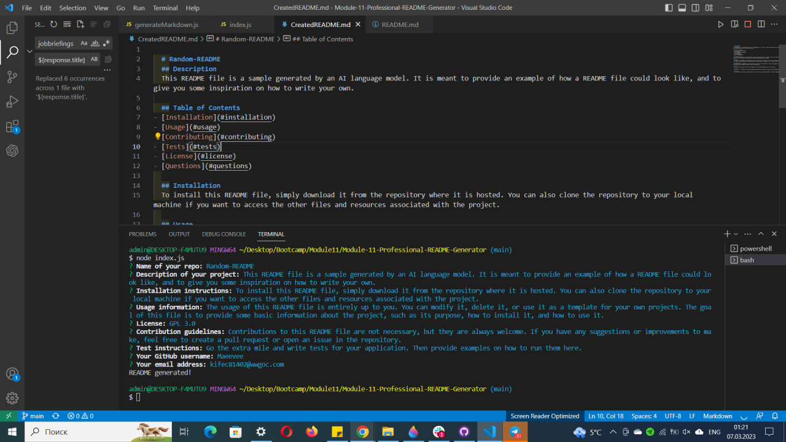

# Professional-README-Generator-by-Kiriakulova
This repository contains a command-line application that generates a professional README.md file from user input. The application is built using Node.js and uses the Inquirer.js package to prompt users for information about their project:

## Installation
To use this application, you will need to have Node.js installed on your computer. You can download Node.js from [the official website](https://nodejs.org/en/).

To install the necessary dependencies, navigate to the root directory of the project and run the following command in terminal:
`npm install`

## Usage
To use the application, navigate to the root directory of the project and run the following command in terminal:
`node index.js`

The application will prompt you for information about your project, including:

* Project title
* Project description
* Installation instructions
* Usage instructions
* Contribution guidelines
* Test instructions
* License
* Link to GitHub profile
* Email

After you have provided all of the necessary information, the application will generate a [README.md](https://github.com/Maeevee/Module-11-Professional-README-Generator/blob/main/CreatedREADME.md) file in the root directory of the project. This filewill also include table of contents and licence badge depending on what the user chooses.

## Credits
This application was created by [@Maeevee](https://github.com/Maeevee) using [Stack Overflow](https://stackoverflow.com/), [shields.io](https://shields.io/category/license) for licence badges and [ChatGPT](https://openai.com/blog/chatgpt/) for creating text for README file that was generated.

## License
MIT License